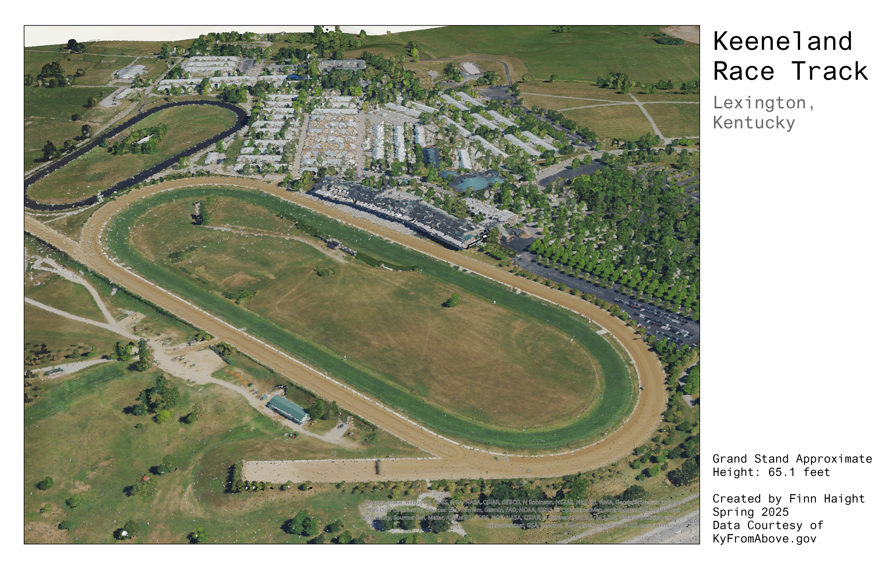
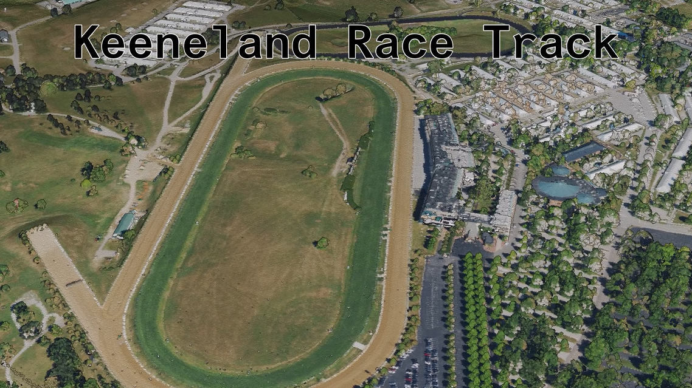

# Keeneland-3D

The Keeneland Race Track is one of the biggest attractions Lexington has to offer. It's large grandstand overlooks the main horse track, and is the centerpoint of the entire property.

Keeneland has been in operation since 1936, and hosts several notable races including the Ashland Stakes and Blue Grass Stakes.

Play Video: [https://youtu.be/Dfx13t7Bibc]